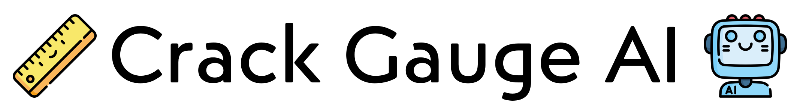

Crack gauges have long been civil engineers' reliable partners in inspection field. Our project Crack Gauge AI aims to introduce AI as our new ally, revolutionizing bridge inspection. It is part of the projects of [Smart Structures & Systems Lab at the University of Seoul](http://shm.uos.ac.kr/) and [Smart Structures Technology Laboratory (SSTL) at the University of Illinois at Urbana Champaign](https://sstl.cee.illinois.edu/)

## Roadmap

### Datasets 

* [X] DeepCrack [[GitHub](https://github.com/yhlleo/DeepCrack)]
* [X] UOSCrack [[GitHub](https://github.com/bhyun-kim/UOSCrackhttps:/)]
* [ ] Crack500 [[GitHub](https://github.com/fyangneil/pavement-crack-detectionhttps:/)]
* [ ] CrackForest [[GitHub](https://github.com/cuilimeng/CrackForest-datasethttps:/)]
